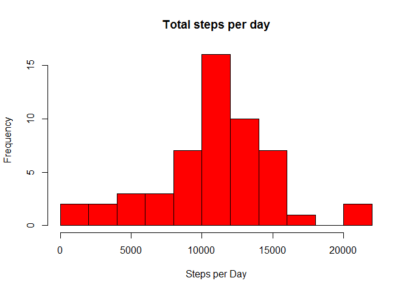
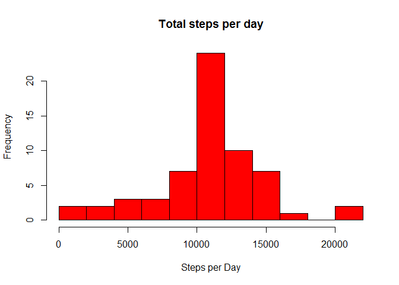
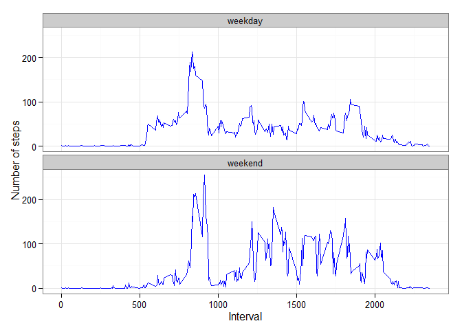

# Reproducible Research: Peer Assessment 1

First, we set echo equal a **TRUE** and results equal a **'hold'** as global options for this document.  

```r
library(knitr)
opts_chunk$set(echo = TRUE, results = 'hold')
```


```r
# load r libraries
sessionInfo()
packages <- c("dplyr", "tidyr",  "ggplot2", "lubridate")
if (length(setdiff(packages, rownames(installed.packages()))) > 0) {
  install.packages(setdiff(packages, rownames(installed.packages())))  
}
sapply(packages, require, character.only=TRUE, quietly=TRUE)

downloadFile <-function(){
        fileUrl <- "https://d396qusza40orc.cloudfront.net/repdata%2Fdata%2Factivity.zip"                    
        download.file(fileUrl,  DATAZIP, method="curl")
        cat(paste0("file download complete - remember to unzip file: ",DATAZIP))        
}   


DEBUG <- TRUE

DATAFILE <- file.path(getwd(), "activity.csv")
DATAZIP  <- file.path(getwd(), "activity.zip")

# check and download data file
if (!file.exists(DATAFILE)) {
  cat(paste0(DATAFILE," doesn't exist"))
  # check data exists
        if (!file.exists(DATAZIP)) {
                cat(paste0(DATAZIP," doesn't exist trying to download ... "))
                downloadFile()
                }
  unzip ("activity.zip")
  stopifnot(file.exists(DATAFILE))          
}   
```

```
## R version 3.1.2 (2014-10-31)
## Platform: x86_64-w64-mingw32/x64 (64-bit)
## 
## locale:
## [1] LC_COLLATE=Greek_Greece.1253  LC_CTYPE=Greek_Greece.1253   
## [3] LC_MONETARY=Greek_Greece.1253 LC_NUMERIC=C                 
## [5] LC_TIME=Greek_Greece.1253    
## 
## attached base packages:
## [1] stats     graphics  grDevices utils     datasets  methods   base     
## 
## other attached packages:
## [1] knitr_1.9
## 
## loaded via a namespace (and not attached):
## [1] digest_0.6.8    evaluate_0.5.5  formatR_1.0     htmltools_0.2.6
## [5] rmarkdown_0.4.2 stringr_0.6.2   tools_3.1.2     yaml_2.1.13    
##     dplyr     tidyr   ggplot2 lubridate 
##      TRUE      TRUE      TRUE      TRUE 
## D:/projectsR/05_ReproducibleResearch/RepData_PeerAssessment1/activity.csv doesn't existD:/projectsR/05_ReproducibleResearch/RepData_PeerAssessment1/activity.zip doesn't exist trying to download ... file download complete - remember to unzip file: D:/projectsR/05_ReproducibleResearch/RepData_PeerAssessment1/activity.zip
```


## Loading and preprocessing the data

Show any code that is needed to

* Load the data (i.e. read.csv())

* Process/transform the data (if necessary) into a format suitable for your analysis


```r
activity <- tbl_df(read.csv(DATAFILE)) %>%
            mutate( date = ymd(date), mydate = date +  minutes(interval)) %>%
            select(steps, date, interval, mydate )
```

Now, let us check the data using `str()` method:


```r
str(activity)
```

```
## Classes 'tbl_df', 'tbl' and 'data.frame':	17568 obs. of  4 variables:
##  $ steps   : int  NA NA NA NA NA NA NA NA NA NA ...
##  $ date    : POSIXct, format: "2012-10-01" "2012-10-01" ...
##  $ interval: int  0 5 10 15 20 25 30 35 40 45 ...
##  $ mydate  : POSIXct, format: "2012-10-01 00:00:00" "2012-10-01 00:05:00" ...
```


## What is mean total number of steps taken per day?

For this part of the assignment, you can ignore the missing values in the dataset.

    1. Calculate the total number of steps taken per day
   

```r
act1 <- activity  %>% na.omit() %>%
        group_by(date) %>%   
        summarise(stepsperDay = sum(steps, na.rm = TRUE)) %>% print
summary(act1)                   
```

```
## Source: local data frame [53 x 2]
## 
##          date stepsperDay
## 1  2012-10-02         126
## 2  2012-10-03       11352
## 3  2012-10-04       12116
## 4  2012-10-05       13294
## 5  2012-10-06       15420
## 6  2012-10-07       11015
## 7  2012-10-09       12811
## 8  2012-10-10        9900
## 9  2012-10-11       10304
## 10 2012-10-12       17382
## ..        ...         ...
##       date                      stepsperDay   
##  Min.   :2012-10-02 00:00:00   Min.   :   41  
##  1st Qu.:2012-10-16 00:00:00   1st Qu.: 8841  
##  Median :2012-10-29 00:00:00   Median :10765  
##  Mean   :2012-10-30 17:12:27   Mean   :10766  
##  3rd Qu.:2012-11-16 00:00:00   3rd Qu.:13294  
##  Max.   :2012-11-29 00:00:00   Max.   :21194
```

    2. Make a histogram of the total number of steps taken each day


```r
hist(act1$stepsperDay, breaks=8, col="red", main ="Total steps per day", xlab="Steps per Day")   
```

 

    3.  Calculate and report the mean and median of the total number of steps taken per day

```r
act3 <- act1  %>% summarise( mean = mean(stepsperDay, na.rm = TRUE),
                             median = median(stepsperDay, na.rm = TRUE)) %>% print
str(act3)
```

```
## Source: local data frame [1 x 2]
## 
##       mean median
## 1 10766.19  10765
## Classes 'tbl_df', 'tbl' and 'data.frame':	1 obs. of  2 variables:
##  $ mean  : num 10766
##  $ median: int 10765
```

The mean is  **10766.189** and median is **10765**.


## What is the average daily activity pattern?

        1. Make a time series plot (i.e. type = "l") of the 5-minute interval (x-axis) and the average number of steps taken, averaged across all days (y-axis)
        

```r
act4 <- activity  %>% na.omit() %>%
        group_by(interval) %>%   
        summarise(stepsperInterval = mean(steps, na.rm = TRUE)) %>% print

ggplot(act4, aes(x=interval, y=stepsperInterval)) +   
        geom_line(color="orange", size=1) +  
        labs(title="Average Daily Activity Pattern", x="Interval", y="Number of steps") +  
        theme_bw()
```

 

```
## Source: local data frame [288 x 2]
## 
##    interval stepsperInterval
## 1         0        1.7169811
## 2         5        0.3396226
## 3        10        0.1320755
## 4        15        0.1509434
## 5        20        0.0754717
## 6        25        2.0943396
## 7        30        0.5283019
## 8        35        0.8679245
## 9        40        0.0000000
## 10       45        1.4716981
## ..      ...              ...
```

        2. Which 5-minute interval, on average across all the days in the dataset, contains the maximum number of steps?

```r
act5 <- act4 %>%  filter(stepsperInterval == max(stepsperInterval)) %>% print
```

```
## Source: local data frame [1 x 2]
## 
##   interval stepsperInterval
## 1      835         206.1698
```

The **835<sup>th</sup>** interval has maximum **206** steps.


## Imputing missing values

Note that there are a number of days/intervals where there are missing values (coded as NA). The presence of missing days may introduce bias into some calculations or summaries of the data.

        1. Calculate and report the total number of missing values in the dataset (i.e. the total number of rows with NAs)


```r
colSums(is.na(activity))
```

```
##    steps     date interval   mydate 
##     2304        0        0        0
```
We are missing **2304** values from steps column

        2. Devise a strategy for filling in all of the missing values in the dataset. The strategy does not need to be sophisticated. For example, you could use the mean/median for that day, or the mean for that 5-minute interval, etc.

To populate missing values, we choose to replace them with the mean value at the same interval across days.

        3. Create a new dataset that is equal to the original dataset but with the missing data filled in.

```r
act7 <- activity  %>%
        group_by(interval) %>% 
        mutate(steps= replace(steps, is.na(steps), mean(steps, na.rm=TRUE)))
```

        4. Make a histogram of the total number of steps taken each day and Calculate and report the mean and median total number of steps taken per day. Do these values differ from the estimates from the first part of the assignment? What is the impact of imputing missing data on the estimates of the total daily number of steps?


```r
act8 <- act7  %>%
        group_by(date) %>%   
        summarise(stepsperDay = sum(steps, na.rm = TRUE),
                  mean = mean(stepsperDay, na.rm = TRUE),
                  median = median(stepsperDay, na.rm = TRUE)) %>% print
str(act8)                   

hist(act8$stepsperDay, breaks=8, col="red", main ="Total steps per day", xlab="Steps per Day")   
```

 

```
## Source: local data frame [61 x 4]
## 
##          date stepsperDay     mean   median
## 1  2012-10-01    10766.19 10766.19 10766.19
## 2  2012-10-02      126.00   126.00   126.00
## 3  2012-10-03    11352.00 11352.00 11352.00
## 4  2012-10-04    12116.00 12116.00 12116.00
## 5  2012-10-05    13294.00 13294.00 13294.00
## 6  2012-10-06    15420.00 15420.00 15420.00
## 7  2012-10-07    11015.00 11015.00 11015.00
## 8  2012-10-08    10766.19 10766.19 10766.19
## 9  2012-10-09    12811.00 12811.00 12811.00
## 10 2012-10-10     9900.00  9900.00  9900.00
## ..        ...         ...      ...      ...
## Classes 'tbl_df', 'tbl' and 'data.frame':	61 obs. of  4 variables:
##  $ date       : POSIXct, format: "2012-10-01" "2012-10-02" ...
##  $ stepsperDay: num  10766 126 11352 12116 13294 ...
##  $ mean       : num  10766 126 11352 12116 13294 ...
##  $ median     : num  10766 126 11352 12116 13294 ...
##  - attr(*, "drop")= logi TRUE
```

The mean is **10766.189** and median is **10765**    .

These values do not differ from the estimates from the first part of the assignment.

- **Before filling the data**
    1. Mean  : **10766.189**
    2. Median: **10765**    
          
- **After filling the data**
    1. Mean  : **10766.189**
    2. Median: **10765**    

We see that the values after filling the data mean and median are equal.


## Are there differences in activity patterns between weekdays and weekends?

For this part the weekdays() function may be of some help here. Use the dataset with the filled-in missing values for this part.
        1. Create a new factor variable in the dataset with two levels – “weekday” and “weekend” indicating whether a given date is a weekday or weekend day.


```r
act9 <- act7 %>% 
                mutate(wd = as.factor(ifelse(wday(date) %in% c(0,7), "weekend", "weekday")) )
                
head(act9)
```

```
## Source: local data frame [6 x 5]
## Groups: interval
## 
##       steps       date interval              mydate      wd
## 1 1.7169811 2012-10-01        0 2012-10-01 00:00:00 weekday
## 2 0.3396226 2012-10-01        5 2012-10-01 00:05:00 weekday
## 3 0.1320755 2012-10-01       10 2012-10-01 00:10:00 weekday
## 4 0.1509434 2012-10-01       15 2012-10-01 00:15:00 weekday
## 5 0.0754717 2012-10-01       20 2012-10-01 00:20:00 weekday
## 6 2.0943396 2012-10-01       25 2012-10-01 00:25:00 weekday
```
	
	2. Make a panel plot containing a time series plot (i.e. type = "l") of the 5-minute interval (x-axis) and the average number of steps taken, averaged across all weekday days or weekend days (y-axis). See the README file in the GitHub repository to see an example of what this plot should look like using simulated data.


```r
act10 <- act9 %>%
        group_by(wd, interval) %>%   
        summarise(stepsperInterval = mean(steps, na.rm = TRUE)) 
        
ggplot(act10, aes(x=interval, y=stepsperInterval)) + 
        geom_line(color="blue") + 
        facet_wrap(~ wd, nrow=2, ncol=1) +
        labs(x="Interval", y="Number of steps") +
        theme_bw()
```

 

We can see at the graph above that activity on the weekday has the greatest peak from all steps intervals. But, we can see too that weekends activities has more peaks over a hundred than weekday. This could be due to the fact that activities on weekdays mostly follow a work related routine, where we find some more intensity activity in little a free time that the employ can made some sport. In the other hand, at weekend we can see better distribution of effort along the time.
